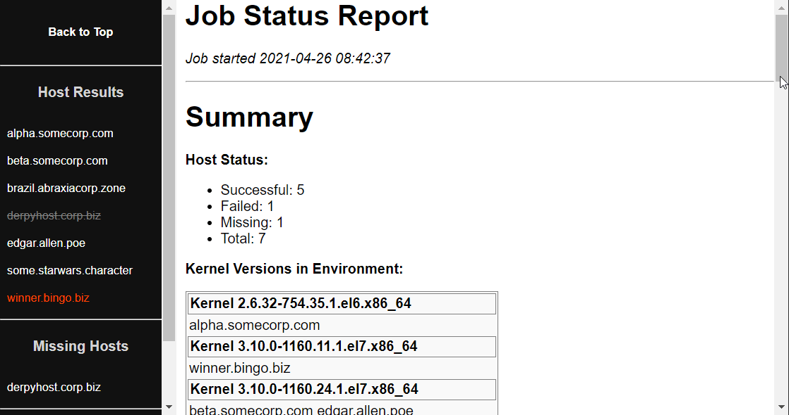

# Better job reporting with Ansible, using Jinja + HTML

If you have Ansible-based jobs that require more elegant reporting or auditing, a common pattern is to assemble an HTML summary report of the work that was done. It's easier than you think, especially if you have an example to start with!



This playbook runs a sample command, gathers some facts, and then generates an HTML summary report. The playbook also supports sending the report as an email attachment.

The report is pure HTML + CSS, with no external dependencies or javascript. If you want to play with your own CSS report layouts, [w3schools](https://www.w3schools.com/css/css_templates.asp) has an interactive CSS editor with some starter templates.

## Contents
```
ansible-job-report/
├── job_report.yaml
├── README.md
├── reports
└── templates
    ├── job_report_host.j2
    ├── job_report_master.j2
    └── stylesheet.css.j2
```

* `job_report.yaml` : The main playbook
* `reports/` : The default save location for HTML reports
* `templates/job_report_master.j2` : The main HTML report template
* `templates/job_report_host.j2` : A report fragment that provides per-host job details
* `templates/stylesheet.css.j2` : Contains CSS stylesheet info, pulled into the master template.

## How to use

1. The `job_report.yaml` playbook is divided into three sections:
   * `pre_tasks:` This is where we set some initial facts for job status, and flag any hosts that are missing.
   * `tasks:` This is where you should put your stuff! There is an example command to get you started.
   * `post_tasks:` This is where the report is assembled. We also mark hosts as 'successful' if they make it that far.
1. See the `vars:` section of the playbook for more settings.
    * To enable email reports- set `send_email: true`, and fill in data for your company's mail server (`smtp_user` and `smtp_pass` are optional).
    * `nav_width`: Width in pixels for the nav bar. Tune this if you have very long hostnames
    * `failed_style` / `missing_style`: This is in-line CSS styling for 'failed' or 'missing' servers in the navbar. To make all host entries look the same in the navbar, set these variables to empty. 
1. In the `pre_tasks` section of the main play, we set two custom facts for all hosts: `job_success: False`, and `missing: True`. Basically, we assume that all hosts are failed-and-missing, until later tasks prove otherwise. This allows us to catch any unresponsive or failed hosts that drop from the play. Unavailable hosts are usually flushed out during fact gathering, so we gather facts manually and set `missing: False` for any survivors.
1. Deciding what "success" means, is important for your report. This playbook sets `job_success: True` in the `post_tasks` section at the end of the playbook. So for this playbook, "success" simply means that the host made it to the end of the play without any fatal errors. Depending on the work you are performing (and your affinity for the `ignore_errors` param), you may want to set another host fact to indicate a partial or successful-with-errors state.
1. When you have When you are comfortable with the default tasks in the playbook, open up `templates/job_report_master.j2`

## Bonus features

Some fun features you may choose to keep:

* **Kernel spread**: The report shows a spread of kernel versions across the environment. This is useful for catching stragglers during routine patching, or else keeping an eye on security fixes. You can use the same technique to report on what versions of a package are installed across your hosts.
* **Color-coded navbar**: Hosts in the navbar are color-coded based on missing or 'failed' status. To tune what a 'missing' or 'failed' host looks like, see the `vars:` section of the main playbook.


